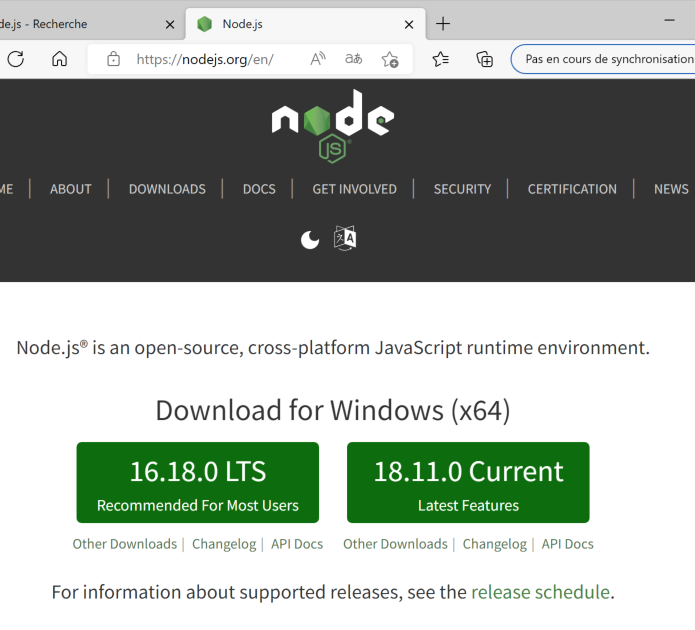

# Pour démarrer (à l'usage des développeurs)

Si vous n'êtes pas développeur, l'[introduction au logiciel de démonstration cyk-compta](/compta-intro/) permet d'avoir un aperçu des possibilité du cadriciel

## Installer NodeJS

Aller au [site de NodeJS](https://www.nodejs.org)
La page de téléchargement se présente comme suit :

- Choisissez la version 16 LTS (Long Term Support)
- Téléchargez et lancez le programme d'installation
- Il n'est pas nécessaire d'installer l'option pour compiler les modules natifs
  
Ouvrez un terminal et tapez la commande 

    node -v
Cela devrait afficher la version du logiciel Node installé.

## Installer Docker Desktop (Mac, Windows)

Aller sur le [site de Docker](https://www.docker.com) :

Téléchargez et installez Docker Desktop
Après la procédure d'installation, l'ordinateur doit redémarrer pour terminer la configuration de l'environnement.

## Installer Visual Studio Code

Aller sur le [site de visual studio code](https://code.visualstudio.com/)

Téléchargez et installez la dernière version stable de Visual Studio Code

## Install CYKLang CLI (Command Line Interface)

    sudo npm install @cyklang/cli -g

Le résultat devrait être le suivant : 

    added 18 packages, and audited 19 packages in 14s

    2 packages are looking for funding
    run `npm fund` for details

    found 0 vulnerabilities

## Initialiser un nouveau répertoire avec cyk init

Créer au préalable un nouveau dossier qui contiendra votre application
A l'intérieur de ce dossier, tapez la commande :

    cyk init

## Lancer docker compose up

    docker compose up

## Tester l'application

    http://localhost:3000

Si vous voyez l'écran suivant, bravo ! Vous avez correctement installé l'application.

